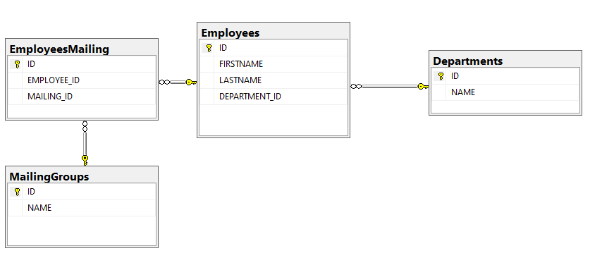
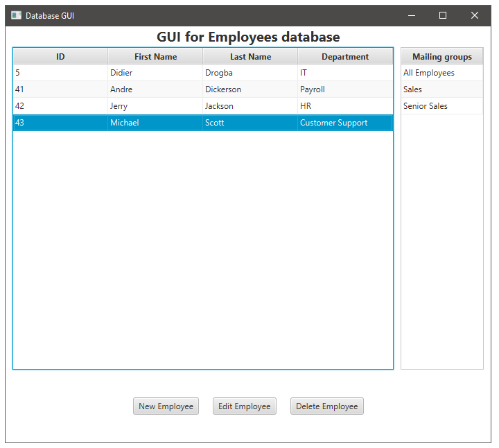
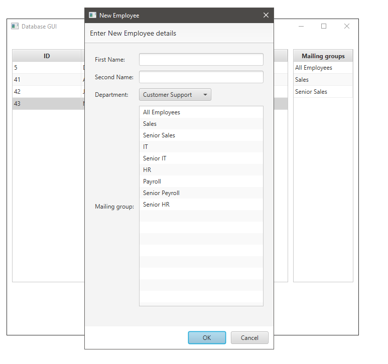
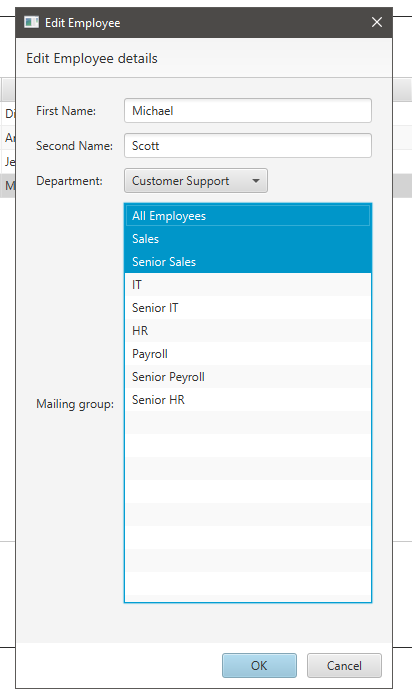
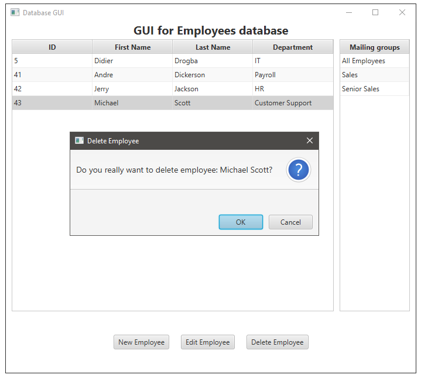

# Java GUI for Database
**Java application created with JavaFX 11 and JDBC for CRUD database operations**

The application is written in Java and FXML with JavaFX SDK and can connect to any database.  

 
 
 

## Motivation
The goal was to create a simple GUI interface for database CRUD operations.

## Built with
* [JavaFX](https://openjfx.io/) - The open source framework for GUI creation in Java.

## Dependencies
**Java:**
* [Amazon Correto 11](https://docs.aws.amazon.com/corretto/latest/corretto-11-ug/downloads-list.html) - Open Java Delevopment Kit certified as compatible with the Java SE standard and used internally at Amazon.

**JavaFX**
* [JavaFX 11](https://docs.aws.amazon.com/corretto/latest/corretto-11-ug/downloads-list.html) - Long term support JavaFX by Gluon.

**JDBC**
* [MS SQL Server](https://docs.microsoft.com/en-us/sql/connect/jdbc/download-microsoft-jdbc-driver-for-sql-server?view=sql-server-ver15) -  Microsoft JDBC database driver to connect to MS SQL Server.

## Author
Marcin Pisarski
